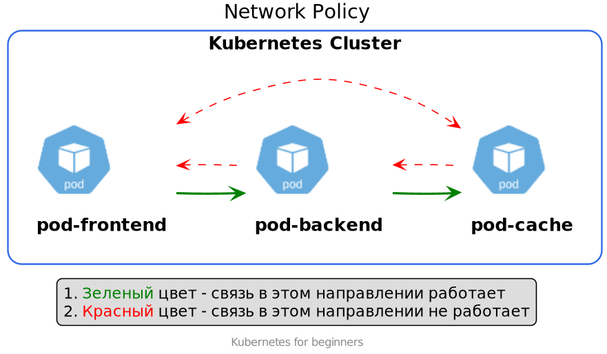

# Network Policy
Объект NetworkPolicy служит для разграничения доступа между подами.

- Документация [Kubernetes](https://kubernetes.io/docs/concepts/services-networking/network-policies/).
- Документация calico [About Network Policy](https://docs.projectcalico.org/about/about-network-policy).

## Инструменты
Для исследования работы принципов Network Policy рекомендую использовать ящик с инструментами [Network-MultiTool](https://github.com/Praqma/Network-MultiTool).

Docker-образы из этого репозитория содержит все необходимые для этого инструменты.

## Настройка NetworkPolicy
Вот пример желаемого поведения:


В нашем приложении реализовано 3 сервиса:
- frontend; 
- backend; 
- cache.

Откуда берутся данные в cache оставим за скобками данного упражнения.
 
Выглядит разумным обеспечить доступ:
- frontend -> backend;
- backend -> cache.

Остальные возможные взаимодействия должны быть запрещены. 

## Проверка доступности между подами с flannel
Сначала развертываем в кластере с установленным CNI плагином flannel.
В этом плагине не реализована работа с NetworkPolicy. 
Поэтому указание NetworkPolicy никак не повлияет на сетевую доступность между подами.

Выдвинем две гипотезы:
1. Без настройки NetworkPolicy все поды будут доступны между собой.
1. После настройки NetworkPolicy все поды будут все еще доступны между собой.

### Развертывание
Для начала необходимо развернуть объекты из подготовленных манифестов.
```shell script
# Развертывание
kubectl apply -f ./templates/main/

# Проверка созданных подов
kubectl get po
``` 

### Проверка доступности между подами
```shell script
kubectl exec backend-7b4877445f-kgvnr -- curl -s -m 1 frontend
kubectl exec backend-7b4877445f-kgvnr -- curl -s -m 1 cache
kubectl exec backend-7b4877445f-kgvnr -- curl -s -m 1 backend
```
В случае отсутствия запретов все поды будут доступны. 
Подобный эксперимент можно провести из любого из созданных подов.

Гипотеза подтвердилась.

### Применение NetworkPolicy
```shell script
kubectl apply -f ./templates/network-policy

kubectl get networkpolicies
```

### Проверка доступности между подами после применения NetworkPolicy
Выполняем те же самые команды. Результат ожидаемо такой же.
А именно все поды доступны со всех подов.

Вторая гипотеза тоже подтвердилась.

Из этого можно сделать вывод, что для работы NetworkPolicy необходим CNI плагин с поддержкой NetworkPolicy.
Одним из таких плагинов является calico.

## Проверка доступности между подами с calico
Повторим эксперимент с проверкой доступности на кластере, на котором используется calico.

Установить такой кластер можно с помощью kubespray. Как это сделать рассматривалось [тут](../../15-install/30-kubespray/README.md).

Снова выдвинем 2 гипотезы:
1. Без настройки NetworkPolicy все поды будут доступны между собой.
1. После настройки NetworkPolicy `backend` будет доступен из `frontend`, `cache` будет доступен из `backend`. Все остальные маршруты будут запрещены.

### Проверка доступности между подами
Проверим это по прежней схеме.
```shell script
kubectl exec backend-7b4877445f-kgvnr -- curl -s -m 1 frontend
kubectl exec backend-7b4877445f-kgvnr -- curl -s -m 1 cache
kubectl exec backend-7b4877445f-kgvnr -- curl -s -m 1 backend
```

После проверки можно увидеть, что 1 гипотеза снова подтвердилась.
Без настройки NetworkPolicy с установленным calico все работает, как и прежде.

### Включение `deny all` режима
Deny all режим - это режим "Все что явно не разрешено - то запрещено". 

С помощью такой конфигурации будут запрещены все входящие соединения для всех подов.
```yaml
apiVersion: networking.k8s.io/v1
kind: NetworkPolicy
metadata:
  name: default-deny-ingress
spec:
  podSelector: {}
  policyTypes:
    - Ingress
```

Применим этот конфиг:
```shell script
kubectl apply -f templates/network-policy/00-default.yaml
```

Проверяем доступность подов между собой.
Поды между собой недоступны.

### Применение NetworkPolicy
Применяем остальные наши сетевые политики. 
```shell script
kubectl apply -f templates/network-policy
```

Теперь проверим доступность между подами по прежней схеме.

Будут доступны поды только по нашей схеме.
- frontend -> backend
- backend -> cache

Остальные варианты недоступны.

Вторая гипотеза подтвердилась полностью.

## Выводы
Для обеспечения безопасной работы с сетью необходимо выполнить 2 пункта:
1. Использовать CNI плагин с поддержкой NetworkPolicy.
1. Необходимо правильно настроить NetworkPolicy.
